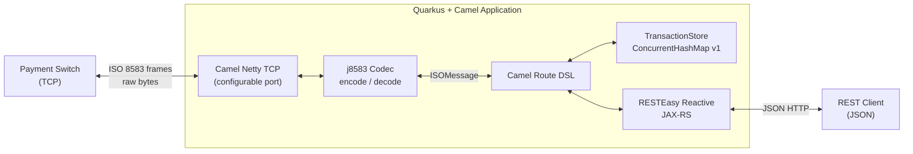

# CLAUDE.md

This file provides guidance to Claude Code (claude.ai/code) when working with code in this repository.

---

## Project

Bidirectional ISO 8583 ↔ JSON protocol bridge. REST clients submit JSON transactions (async, 202 + UUID) and poll for results. The integration converts JSON to binary ISO 8583, forwards over TCP to a payment switch, receives the response, and makes it available via the poll endpoint.

Full design spec: `docs/superpowers/specs/2026-05-13-camel-iso-json-design.md`
Full implementation plan: `docs/superpowers/plans/2026-05-13-camel-iso-json-bridge.md`

---

## Commands

```bash
# Dev mode (hot reload)
./mvnw quarkus:dev

# Unit tests only
./mvnw test

# Unit + integration tests
./mvnw verify

# Single test class
./mvnw test -Dtest=InMemoryTransactionStoreTest

# Single integration test
./mvnw verify -Dit.test=FullFlowIT

# Package
./mvnw package

# Native build (GraalVM 21+ required)
./mvnw package -Pnative
```

REST endpoints are available at `http://localhost:8080/api/v1/transactions` in dev mode.

---

## Architecture



**Key design decisions:**
- `TransactionStore` is an interface — `ConcurrentHashMap` in v1, Infinispan in v2 (clustering), PostgreSQL in v2 (audit trail). No route changes required to swap the implementation.
- STAN (ISO 8583 field 11) is the correlation key between outbound requests and switch responses. `StanGenerator` produces atomic 6-digit values.
- `ISO8583Decoder`/`ISO8583Encoder` handle the 2-byte length-prefix framing. j8583 handles the ISO 8583 field parsing — these two concerns are kept separate.
- `JsonToIsoProcessor` and `IsoToJsonProcessor` are the only classes that know both the JSON model and the ISO 8583 field layout.

**Data flow (outbound):**
```
POST /transactions → TransactionResource → save PENDING state → asyncSend direct:send-iso8583
→ JsonToIsoProcessor → Netty TCP → switch → ISO8583Encoder
switch → Netty TCP → ISO8583Decoder → IsoToJsonProcessor → update state to COMPLETED
GET /transactions/{id} → returns COMPLETED state with result
```

**Data flow (inbound unsolicited):**
```
switch → Netty TCP server → ISO8583Decoder → IsoToJsonProcessor → save as RECEIVED
→ build 0210/0410 ack → ISO8583Encoder → switch
GET /transactions?type=inbound → returns RECEIVED events
```

---

## Package Layout

```
src/main/java/id/redhat/razhari/
├── model/       TransactionStatus, TransactionRequest, TransactionState, TransactionResponse
├── store/       TransactionStore (interface) + InMemoryTransactionStore (@ApplicationScoped)
├── codec/       ISO8583Decoder, ISO8583Encoder (Netty ByteToMessageDecoder/MessageToByteEncoder)
├── config/      MessageFactoryProducer, ISO8583ServerInitializer, ISO8583ClientInitializer
├── util/        StanGenerator (atomic 6-digit counter)
├── processor/   JsonToIsoProcessor, IsoToJsonProcessor (Camel @Named processors)
├── route/       ISO8583SendRoute, ISO8583ServerRoute, CleanupRoute
└── rest/        TransactionResource (JAX-RS)

src/main/resources/
├── application.properties   All camel.iso8583.* config properties
└── j8583.xml                ISO 8583 field definitions for MTI 0200/0210/0400
```

---

## Configuration

All tunables are in `application.properties`. Key properties:

```properties
quarkus.http.port=8080
quarkus.http.root-path=/api/v1

camel.iso8583.server.port=9583              # TCP port listening for switch messages
camel.iso8583.switch.host=localhost         # Outbound switch hostname
camel.iso8583.switch.port=8583             # Outbound switch port
camel.iso8583.netty.connect-timeout=5000
camel.iso8583.netty.retry-attempts=3
camel.iso8583.netty.retry-delay=2000
camel.iso8583.transaction.timeout-ms=30000
camel.iso8583.transaction.cleanup-interval-ms=60000
```

Test overrides live in `src/test/resources/application.properties`.

---

## Testing Strategy

- **Unit tests** (plain JUnit 5, no Quarkus runtime): `store/`, `codec/`, `util/`, `processor/` packages. Fast, no app startup.
- **REST tests** (`@QuarkusTest` + `@InjectMock`): `rest/` package. Full Quarkus app, mocked `TransactionStore` and `ProducerTemplate`.
- **End-to-end** (`@QuarkusIntegrationTest`): `functional/FullFlowIT`. Starts `MockISO8583Switch` (real Netty TCP server) on port 19999, submits transactions, polls until COMPLETED.

Run unit tests before integration tests: `./mvnw test` then `./mvnw verify`.

---

## Dependencies

### Red Hat BOMs
- `com.redhat.quarkus.platform:quarkus-bom:3.27.3.SP1-redhat-00002` (Quarkus platform — from Red Hat GA repo)
- `io.quarkus.platform:quarkus-camel-bom:3.27.3` (Camel BOM — uses upstream version, not RHBQ-qualified)

Red Hat GA Maven repository: `https://maven.repository.redhat.com/ga/`

### Runtime
| Artifact | Purpose |
|---|---|
| `camel-quarkus-iso8583` | ISO 8583 message encoding/decoding (j8583 is a transitive dep) |
| `camel-quarkus-netty` | TCP client + server (Netty 4.x) |
| `camel-quarkus-direct` | Internal Camel route wiring |
| `camel-quarkus-jackson` | JSON marshalling in routes |
| `camel-quarkus-timer` | Cleanup route scheduling |
| `quarkus-rest` | RESTEasy Reactive (Quarkus 3.x REST) |
| `quarkus-rest-jackson` | Jackson JSON support for REST |
| `quarkus-arc` | CDI dependency injection |

### j8583 Integration Notes
`camel-quarkus-iso8583` brings j8583 as a transitive dependency — do NOT add `com.solab:j8583` directly to `pom.xml`. The j8583 classes (`ISOMessage`, `MessageFactory`, `ConfigParser`) are still used directly in `codec/`, `config/`, and `processor/` packages; they arrive via the classpath automatically.

j8583 does not include a Netty codec. The bridge between j8583 and Netty is `ISO8583Decoder` / `ISO8583Encoder` in the `codec/` package. These handle the 2-byte length prefix; j8583's `MessageFactory` handles the ISO 8583 binary format. Configure the factory by calling:
```java
ConfigParser.configureFromClasspathConfig(factory, "j8583.xml");
```
The `j8583.xml` file defines which field numbers are expected per MTI (`<parse type="0200">`) and default field values (`<template type="0200">`). Add new MTI support there, not in Java code.

`ISO8583Decoder` extends `ByteToMessageDecoder` which is **not** `@Sharable` — new instances must be created per channel. `ISO8583ServerInitializer` and `ISO8583ClientInitializer` (extending Camel's `ServerInitializerFactory` / `ClientInitializerFactory`) do this correctly.

---

## Future Versions (documented in spec)

| Version | Addition | Key dependency |
|---|---|---|
| v2 | Audit trail + restart recovery | `quarkus-hibernate-orm-panache` + `quarkus-jdbc-postgresql` |
| v3 | Clustering (distributed store) | `quarkus-infinispan-client` |
| v4 | Broker for extreme scale (10k+ TPS) | `camel-quarkus-sjms2` + ActiveMQ Artemis |

Swap the implementation by adding a new `@ApplicationScoped` bean that implements `TransactionStore` and moving the `@Primary` qualifier — no route or REST changes required.

---

## jPOS Reference (learning)

jPOS is an alternative ISO 8583 framework used in standalone payment middleware. It was **not chosen** for this implementation because its `TransactionManager` threading model conflicts with Quarkus's Vert.x event loop and has limited GraalVM native-image support. Full jPOS implementation notes and trade-offs are in the design spec section 10.

Key jPOS concepts for reference:
- `ISOMsg` — the message object (equivalent to j8583's `ISOMessage`)
- `NACChannel` / `ASCIIChannel` — handles TCP + ISO 8583 framing (replaces our Netty codec)
- `ISOServer` — accepts TCP connections (replaces `camel-quarkus-netty` server route)
- `ISO87APackager` / `GenericPackager` — defines field layout (equivalent to `j8583.xml`)
- `TransactionManager` — jPOS's saga-style coordinator (we use Camel routes instead)
