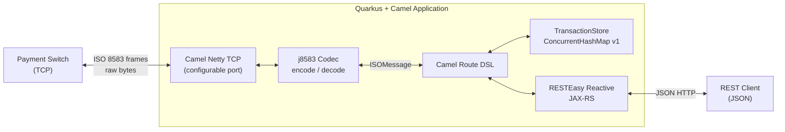
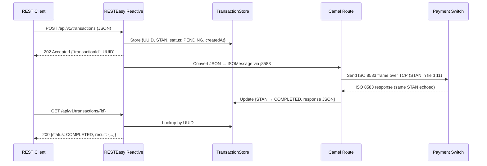
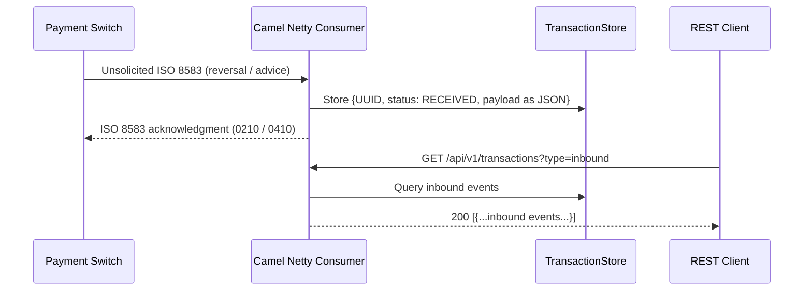
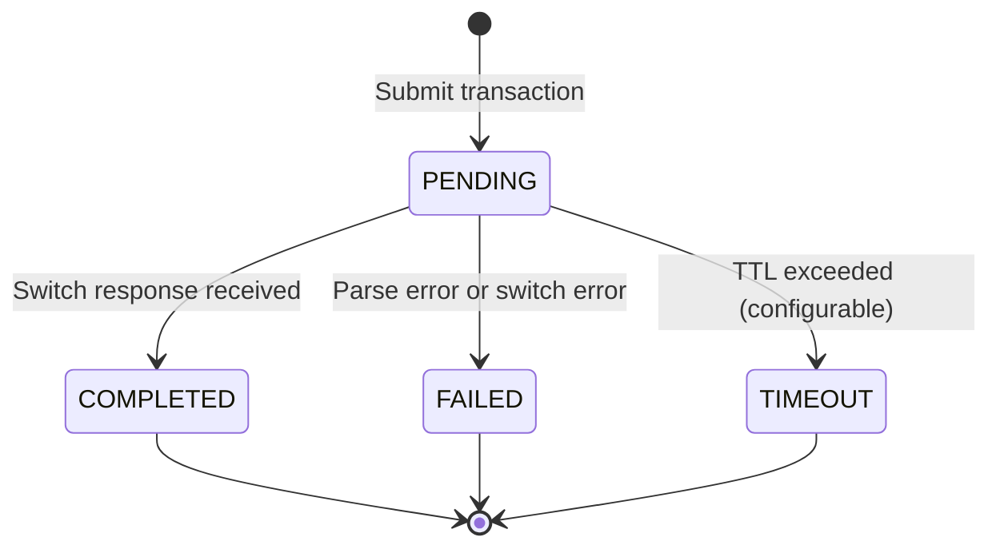
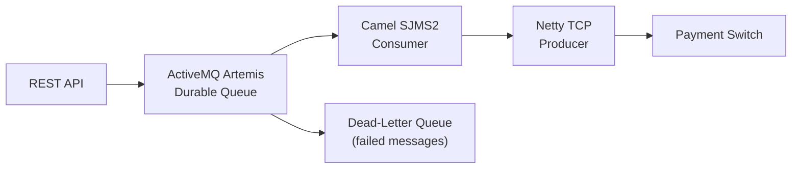

# Design Spec: Quarkus Camel ISO 8583 ↔ JSON Bridge

**Date:** 2026-05-13
**Status:** Approved

---

## 1. Overview

A bidirectional protocol bridge built with Red Hat Quarkus 3.x and Apache Camel 4.x that:

- Listens for ISO 8583 binary messages from a payment switch over raw TCP
- Exposes a JSON REST API for internal clients (async submit + poll pattern)
- Converts between ISO 8583 binary frames and JSON in both directions
- Correlates outbound requests to inbound switch responses via ISO 8583 field 11 (STAN)

---

## 2. Architecture



### Components

| Component | Technology | Role |
|---|---|---|
| TCP layer | `camel-quarkus-netty` | Persistent socket to/from switch |
| ISO 8583 codec | `j8583` | Encode/decode binary frames (MTI + bitmap + fields) |
| Routing engine | Apache Camel 4.x DSL | Wires TCP ↔ REST, transforms messages, handles correlation |
| REST API | Quarkus RESTEasy Reactive | JSON endpoints, async submit + poll |
| Transaction store | `ConcurrentHashMap` (v1) | Correlates STAN to transaction state + result |

---

## 3. Data Flow

### Outbound (REST client → Switch)



### Inbound (Switch-initiated message → stored event)



### Correlation Key

ISO 8583 field 11 (STAN — System Trace Audit Number) is the correlation key. Every outbound message gets a unique STAN; the switch echoes it in the response, enabling exact matching without maintaining TCP session state.

---

## 4. REST API

**Base path:** configurable via `camel.iso8583.rest.base-path` (default `/api/v1`)

| Method | Path | Request Body | Response | Description |
|---|---|---|---|---|
| `POST` | `/transactions` | JSON transaction | `202` + `transactionId` | Submit transaction to switch |
| `GET` | `/transactions/{id}` | — | JSON result or PENDING state | Poll for result |
| `GET` | `/transactions/{id}/status` | — | `{ status, createdAt, updatedAt }` | Lightweight status check |
| `GET` | `/transactions` | `?type=inbound` | List of events | Query switch-initiated messages |

### Transaction States



### Sample Submit Request

```json
POST /api/v1/transactions
{
  "mti": "0200",
  "pan": "4111111111111111",
  "amount": 10000,
  "currency": "840",
  "terminalId": "TERM0001",
  "merchantId": "MERCH001"
}
```

### Sample Poll Response (completed)

```json
GET /api/v1/transactions/abc-uuid
{
  "transactionId": "abc-uuid",
  "status": "COMPLETED",
  "createdAt": "2026-05-13T10:00:00Z",
  "updatedAt": "2026-05-13T10:00:01Z",
  "result": {
    "mti": "0210",
    "responseCode": "00",
    "authCode": "123456",
    "stan": "000042"
  }
}
```

---

## 5. Configuration

All tunables are injected via `application.properties` using `@ConfigProperty`:

```properties
# TCP Server (listening for switch connections)
camel.iso8583.server.port=9583

# Switch connection (outbound)
camel.iso8583.switch.host=localhost
camel.iso8583.switch.port=8583
camel.iso8583.netty.connect-timeout=5000
camel.iso8583.netty.retry-attempts=3
camel.iso8583.netty.retry-delay=2000

# Transaction lifecycle
camel.iso8583.transaction.timeout-ms=30000
camel.iso8583.transaction.cleanup-interval-ms=60000

# REST API
camel.iso8583.rest.host=0.0.0.0
camel.iso8583.rest.port=8080
camel.iso8583.rest.base-path=/api/v1
```

---

## 6. Error Handling

| Scenario | Behaviour |
|---|---|
| Switch unreachable | Netty retry with backoff (`retry-attempts` × `retry-delay`); REST returns `503` |
| Switch timeout (no response within TTL) | Timer route moves state to `TIMEOUT`; poll returns `408` |
| Invalid JSON from client | RESTEasy validation returns `400` before Camel is invoked |
| Malformed ISO 8583 frame | j8583 parse exception caught in Camel `onException`; STAN state set to `FAILED` |
| Unknown STAN in response | Logged as warning, response dropped |
| Duplicate STAN | Existing state preserved, duplicate logged and ignored |

A global Camel `onException` handler logs structured JSON errors via Quarkus logging. Raw stack traces are never surfaced in REST responses.

---

## 7. Project Structure

```
camel-iso-json/
├── src/main/java/com/example/isojson/
│   ├── codec/          # j8583 MessageFactory config + Netty ByteToMessage codec
│   ├── model/          # TransactionRequest, TransactionState, ISOMessageDTO
│   ├── route/          # Camel RouteBuilder classes (TCP inbound, REST, timer/cleanup)
│   ├── processor/      # JSON→ISO8583 and ISO8583→JSON field mappers
│   ├── store/          # TransactionStore interface + ConcurrentHashMap impl
│   └── rest/           # JAX-RS resource classes
├── src/main/resources/
│   ├── application.properties
│   └── j8583.xml       # j8583 message templates (field type + length per MTI)
└── pom.xml
```

The `TransactionStore` interface is the primary extension point — the `ConcurrentHashMap` implementation can be replaced with Infinispan for clustering without touching any route logic.

---

## 8. Dependencies

### Red Hat BOM (pom.xml)

```xml
<properties>
  <quarkus.platform.group-id>com.redhat.quarkus.platform</quarkus.platform.group-id>
  <quarkus.platform.artifact-id>quarkus-bom</quarkus.platform.artifact-id>
  <quarkus.platform.version>3.15.3.SP1</quarkus.platform.version>
</properties>

<dependencyManagement>
  <dependencies>
    <dependency>
      <groupId>${quarkus.platform.group-id}</groupId>
      <artifactId>${quarkus.platform.artifact-id}</artifactId>
      <version>${quarkus.platform.version}</version>
      <type>pom</type>
      <scope>import</scope>
    </dependency>
    <dependency>
      <groupId>${quarkus.platform.group-id}</groupId>
      <artifactId>quarkus-camel-bom</artifactId>
      <version>${quarkus.platform.version}</version>
      <type>pom</type>
      <scope>import</scope>
    </dependency>
  </dependencies>
</dependencyManagement>
```

### Runtime Dependencies

```xml
<!-- Camel Quarkus extensions -->
<dependency>
  <groupId>org.apache.camel.quarkus</groupId>
  <artifactId>camel-quarkus-netty</artifactId>
</dependency>
<dependency>
  <groupId>org.apache.camel.quarkus</groupId>
  <artifactId>camel-quarkus-rest</artifactId>
</dependency>
<dependency>
  <groupId>org.apache.camel.quarkus</groupId>
  <artifactId>camel-quarkus-jackson</artifactId>
</dependency>
<dependency>
  <groupId>org.apache.camel.quarkus</groupId>
  <artifactId>camel-quarkus-timer</artifactId>
</dependency>

<!-- Quarkus REST -->
<dependency>
  <groupId>io.quarkus</groupId>
  <artifactId>quarkus-resteasy-reactive-jackson</artifactId>
</dependency>

<!-- ISO 8583 parsing -->
<dependency>
  <groupId>com.solab</groupId>
  <artifactId>j8583</artifactId>
  <version>1.18.0</version>
</dependency>

<!-- Config + DI -->
<dependency>
  <groupId>io.quarkus</groupId>
  <artifactId>quarkus-arc</artifactId>
</dependency>
```

### How j8583 Integrates with Camel Netty

j8583 does not ship a Netty codec — you write a thin `ByteToMessageDecoder` / `MessageToByteEncoder` pair that delegates to j8583's `MessageFactory`:

```java
// Decoder: raw bytes → ISOMessage
public class ISO8583Decoder extends ByteToMessageDecoder {
    private final MessageFactory<ISOMessage> factory;

    @Override
    protected void decode(ChannelHandlerContext ctx, ByteBuf in, List<Object> out) {
        if (in.readableBytes() < 2) return;          // wait for length header
        int length = in.getUnsignedShort(in.readerIndex());
        if (in.readableBytes() < length + 2) return; // wait for full frame
        in.skipBytes(2);
        byte[] bytes = new byte[length];
        in.readBytes(bytes);
        out.add(factory.parseMessage(bytes, 0));
    }
}

// Encoder: ISOMessage → raw bytes
public class ISO8583Encoder extends MessageToByteEncoder<ISOMessage> {
    @Override
    protected void encode(ChannelHandlerContext ctx, ISOMessage msg, ByteBuf out) {
        byte[] bytes = msg.writeData();
        out.writeShort(bytes.length);  // 2-byte length prefix
        out.writeBytes(bytes);
    }
}
```

Wire these into the Camel Netty endpoint via `encoders`/`decoders` options:

```java
from("netty:tcp://{{camel.iso8583.server.port}}" +
     "?serverInitializerFactory=#iso8583ChannelInitializer" +
     "&sync=true")
```

---

## 9. Evolution Path (Future Versions)

### v2 — Audit Trail + Restart Recovery (PostgreSQL + Panache)

Add `quarkus-hibernate-orm-panache` and `quarkus-jdbc-postgresql`. Create a `TransactionEntity` table:

```sql
CREATE TABLE transactions (
  id UUID PRIMARY KEY,
  stan VARCHAR(6) NOT NULL,
  status VARCHAR(16) NOT NULL,
  request_json TEXT,
  response_json TEXT,
  created_at TIMESTAMP,
  updated_at TIMESTAMP
);
```

The `TransactionStore` interface gains a `PostgresTransactionStore` implementation. On startup, load `PENDING` rows from the database and resume timeout tracking — this covers the restart-recovery case.

### v3 — Clustering (Infinispan)

Add `quarkus-infinispan-client`. Create an `InfinispanTransactionStore` implementation backed by a distributed cache. The cache entry TTL replaces the Camel timer cleanup route. No route changes required — only a new `TransactionStore` bean is added and the `@Primary` qualifier is moved.

### v4 — Message Broker (ActiveMQ Artemis / Kafka)

At extreme scale (10k+ TPS), introduce a broker between the REST layer and the ISO 8583 sender:



This adds durable queuing, backpressure, and dead-letter handling at the cost of operational complexity.

---

## 10. jPOS Alternative (Reference)

jPOS is a full-featured Java ISO 8583 framework used in production financial systems. This section documents how it would replace the Netty + j8583 stack for learning purposes.

### Key jPOS Concepts

| Concept | jPOS Class | Role |
|---|---|---|
| Message | `ISOMsg` | Represents one ISO 8583 message (MTI + fields) |
| Channel | `NACChannel`, `ASCIIChannel`, `XMLChannel` | TCP transport + framing |
| Server | `ISOServer` | Accepts incoming TCP connections |
| Packager | `ISO87APackager`, `GenericPackager` | Defines field types and lengths |
| Transaction Manager | `TransactionManager` | jPOS's own saga/transaction coordinator |

### jPOS TCP Server Setup

```java
// Define field layout
ISOPackager packager = new ISO87APackager();

// Create server channel (handles TCP + ISO 8583 framing)
ServerChannel channel = new NACChannel(packager);

// Start server
ISOServer server = new ISOServer(8583, channel, null);
server.addISORequestListener((source, m) -> {
    // m is an ISOMsg — handle inbound message here
    String mti = m.getMTI();        // e.g. "0200"
    String pan = m.getString(2);    // field 2 = PAN
    String amount = m.getString(4); // field 4 = amount
    // ... bridge to Camel via ProducerTemplate
    return true;
});
new Thread(server).start();
```

### jPOS Outbound (Client Channel)

```java
ISOChannel client = new NACChannel("switch-host", 8583, packager);
client.connect();

ISOMsg msg = new ISOMsg();
msg.setMTI("0200");
msg.set(2, "4111111111111111");  // PAN
msg.set(4, "000000010000");      // Amount
msg.set(11, "000042");           // STAN

client.send(msg);
ISOMsg response = client.receive();
String responseCode = response.getString(39);
```

### Why jPOS Was Not Chosen for This Implementation

1. **Threading conflict:** jPOS's `TransactionManager` uses its own thread pool and participant pattern, which conflicts with Quarkus's Vert.x event loop and Camel's reactive executor.
2. **Dependency weight:** jPOS pulls in its own XML configuration system (`Q2`), logging, and transaction infrastructure — significant overlap with Quarkus.
3. **Native compilation:** jPOS has limited GraalVM native-image support; `camel-quarkus-netty` is fully native-compilable.
4. **Camel integration:** There is no official `camel-quarkus-jpos` extension. Bridging requires manual bean wiring, losing Camel's route DSL benefits.

jPOS remains the right choice for standalone financial middleware or when building a full-stack payment switch — not when embedding inside a Quarkus/Camel application.
